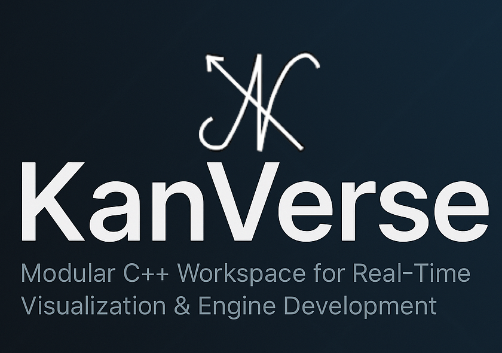

<p align="center">
  
</p>

<p align="center">
  
  
  
  
</p>

<h1 align="center">🌀 KanVerse</h1>

<p align="center">
  <i>Modular C++ workspace for graphics, visualization, and real-time application development — powered by the <b>iKanViz</b> engine.</i>
</p>

<p align="center">
  
  
  
</p>

---

## 🧭 Overview

**KanVerse** is a modular **C++ development workspace** built for high-performance, real-time applications.  
It acts as a central hub for multiple modular projects 
— from visualization tools like **iKanVest** to potential **game engines** 
— all powered by the in-house **iKanViz** visualization & rendering engine.

> 💡 *One workspace. Infinite possibilities.*

---

## 🧩 Components

| Component   | Description |
|-------------|-------------|
| **🧠 iKanViz**    | The **core rendering and visualization engine** of KanVerse. Provides OpenGL-based rendering, ImGui UI layer, and visualization utilities. |
| **💼 iKanVest**   | A portfolio-management and data-visualization application built on top of iKanViz. Future applications will reuse the same engine. |
| **🎨 iKanStudio** | A visual editor and sandbox built on **iKanViz** for creating, editing, and managing interactive content — from games to real-time simulations. |

---

## ⚙️ Features

- 🧱 **Modular Architecture** — multiple applications share one unified engine  
- 🪟 **Cross-Platform Rendering** — OpenGL backend now, Metal planned for macOS  
- 🖥️ **Immediate-Mode UI** — ImGui integration for quick iteration  
- 📊 **Visualization Engine** — real-time data rendering, charting (via ImPlot optional)  
- 📂 **Data Import System** — import CSV/Excel data for portfolios or analytics  
- 🌐 **WebAssembly Ready** — planned Emscripten support for browser builds  

---

## 🧰 Tech Stack

| Category            | Tools / Libraries                     |
|---------------------|--------------------------------------|
| **Language**        | C++17 / C++20                        |
| **Rendering**       | OpenGL (Metal planned)               |
| **UI System**       | ImGui                                |
| **Windowing / Input**| GLFW                                |
| **Build System**    | CMake                                |
| **Visualization**   | ImPlot (optional)                    |
| **Data Handling**   | fast-cpp-csv-parser / xlnt           |
| **Web Support**     | Emscripten (future)                  |

---

## 🏗️ Workspace Structure

```KanVerse/
├── iKanViz/ ← Core visualization & rendering engine
│ ├── src/
│ ├── include/
│
├── iKanVest/ ← Portfolio management application (uses iKanViz)
│ ├── src/
│ ├── include/
│
├── third_party/ ← External dependencies (GLFW, GLAD, ImGui, ImPlot, etc.)

```
---

## 🚀 Goals & Vision

KanVerse aims to be a **multi-purpose, high-performance framework** capable of powering:

- 💼 Portfolio & financial visualization apps  
- 🎮 Game engines or simulation tools  
- 📊 Analytical dashboards & interactive charts  
- 🌐 WebAssembly-based applications  
- 🧠 Developer plugins and experimental modules  

> Built for creativity, designed for performance.

---

## 🧱 Roadmap

| Milestone | Description                                   | Status  |
|-----------|-----------------------------------------------|---------|
| **v0.1**  | Initialize KanVerse workspace & build system  | 🟩 Planned |
| **v0.2**  | Integrate OpenGL + ImGui in iKanViz           | 🟩 Planned |
| **v0.3**  | Develop base UI & CSV loader in iKanVest      | 🟩 Planned |
| **v0.4**  | Add data visualization with ImPlot            | ⬜ Pending |
| **v0.5**  | Build WebAssembly version using Emscripten    | ⬜ Pending |
| **v1.0**  | Introduce game engine module under KanVerse   | ⬜ Future  |

---

## 🧠 Design Philosophy

> “Build once, extend infinitely.”

KanVerse is founded on four pillars:  
1. 🧩 **Modularity** — core engine + independent apps  
2. 🔁 **Reusability** — shared rendering, UI, and data components  
3. ⚡ **Performance** — native C++ with optimized rendering  
4. 🌍 **Scalability** — desktop, web, and future platforms  

---
## 📜 License

MIT License

---

## 💬 Author

**Developer:** Ashish  
**Role:** Software Engineer / Creator of KanVerse  
**Focus:** Real-time graphics, visualization, and engine development  
📧 *ikan.1009@gmail.com*  

---

## 🌟 Acknowledgments

- [GLFW](https://www.glfw.org/)  
- [ImGui](https://github.com/ocornut/imgui)  
- [GLAD](https://glad.dav1d.de/)  
- [ImPlot](https://github.com/epezent/implot)  
- Open-source graphics and C++ communities inspiring KanVerse

---

<p align="center">
  <i>KanVerse — A modular C++ universe for visualization, creativity, and real-time development.</i><br><br>
  
</p>
